      
Commands : 
sudo apt-get install build-essential
```
/usr/share/dbus-1/interfaces directory.
$ busctl list
$ busctl tree
```
# D-Bus: 

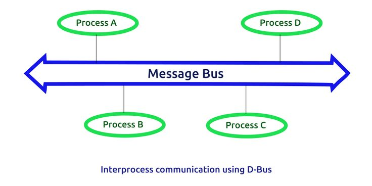

1.  Created in 2002
2.  Is part of the freedesktop.org project
3.  Maintained by RedHat and the community
4.  Is an Inter-process communication mechanism
5.  Initiated to standardize services of Linux desktop environments
6. D-Bus is an IPC mechanism using sockets
7. Should be used only for control
8. Uses services, interfaces and objects
9.  Provides methods, properties and signals
10. Many bindings are available in different languages: Qt, C++, Python, Java, etc
11.  Used in many projects: the kernel has even tried to implement a kdbus but
abandonned it
# What is Inter-Process Communication (IPC)
Meannig shearing of the data between two processes 

## Mechanisms allowing processes to communicate with each other: 

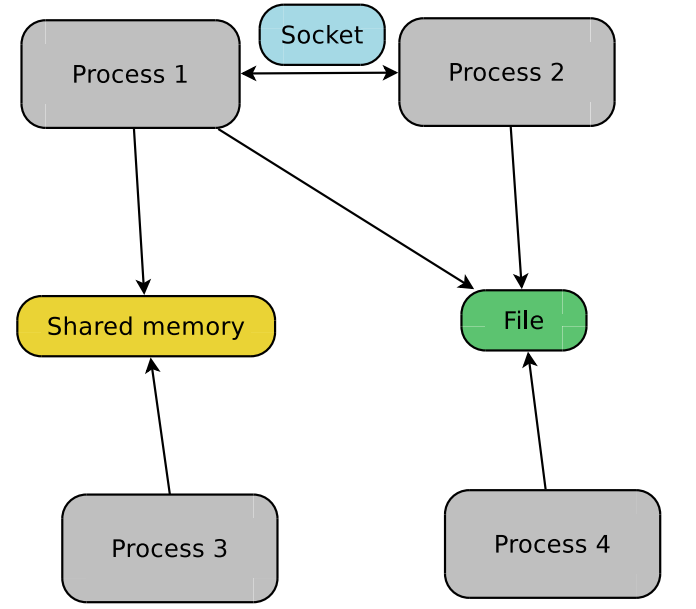

1. Shared memory: read/write into a defined memory location
2.  Memory-mapped file: same as shared memory but uses a file
I Pipe: two-way data stream
(standard input / output)

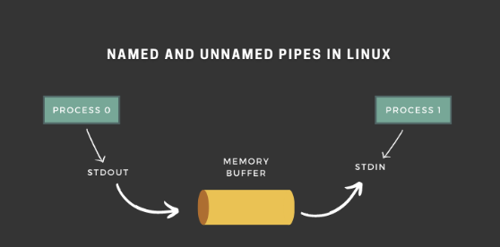

3.  Named pipe: same as pipe but
uses a file (FIFO)
4.  Socket: communication even on
distant machines
5.  and others

# How IPC using D-Bus work
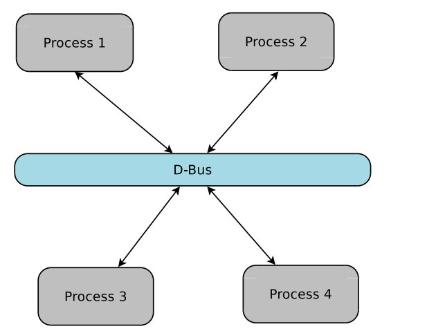

1. Uses the socket mechanism
2. Provides software bus abstraction
3. Way simpler than most alternatives

## Elements OF D-BUS
1. libdbus: a low-level library and The libdbus library is an implementation of the wire protocol. It provides the C Language interface for communication between two processes

2. dbus-daemon: a daemon based on libdbus. Handles and controls data transfers
between DBus peers `There may be multiple D-Bus daemons running in the system at a time`
3. two types of busses: a `system` and a `session` . Each bus instance is managed
by a `dbus-daemon`
4. a security mechanism using `policy` files

## System & Session busses

1. system D-BUS  
- daemon for communication between the kernel, system-wide services and the user
- On embedded Linux systems, this bus is often the only D-Bus type
2. session D-BUS
daemon, primarily intended for communication between processes for the desktop applications of the logged-in user
## Basic Termonology [Meanning of message and it's contents]
1. Message

   - is the unit of data transfer between processes. 
   - Messages are discreet as opposed to continuous stream of data transferred between processes by mechanisms like pipes
   - A message has 
         a header, which identifies its sender, receiver and method or signal name, etc. and message body containing a data payload.

2. Message Types 

    There are four types of messages  
      - SIGNAL: A SIGNAL is a message that is broadcast by a process and can be received by other interested processes.


      - METHOD_CALL A METHOD_CALL message is a request by the sender for a particular operation on an object of the receiver 
      and The sender could be a client, requesting the execution of a method by the server

      - METHOD_RETURN  METHOD_RETURN message containing the result(s) of the operation. Or, if there was an error, the receiver can respond with an ERROR message.
      -  ERROR

D-BUS Damons:

1. Message bus:
A message bus is a daemon process which routes messages between other processes

2. Service

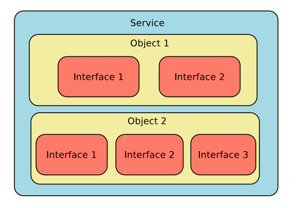

  - A service is a daemon process that provides some utility in the system. A service is a server process which does work for the clients. A service has a singleton object.

  - One D-Bus service contains object(s) which implements interface(s)
  - An application can expose its services to all D-Bus users by registering to a bus instance
  - A service is a collection of objects providing a specific set of features
  - When an application opens a connection to a bus instance, it is assigned a unique name (ie :1.40)


  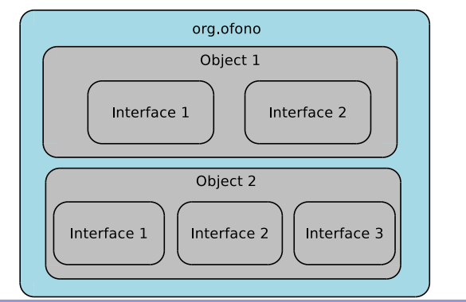


  - Can request a more human-readable service name: the well-known name (ieorg.ofono)

3. Object
An object is an entity in a process, which does some work. An object is identified by a path name. A path is like a complete file name in the system. So, an object might have a path name like, /com/example/someserver. An object has members, which means methods and signals.
- Are attached to one service
- Can be dynamically created or removed
 
  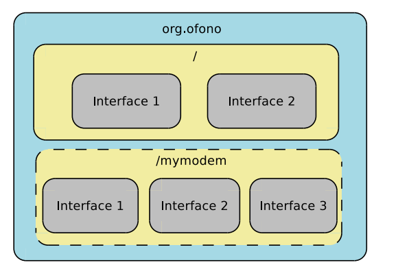

-  Are uniquely identified by an object path (ie / or
/net/connman/technology/cellular)
- Implement one or several interfaces

4. Interfaces

An interface is a group of functions. An object supports one or more interfaces. The interfaces supported by an object specify the members of that object.
  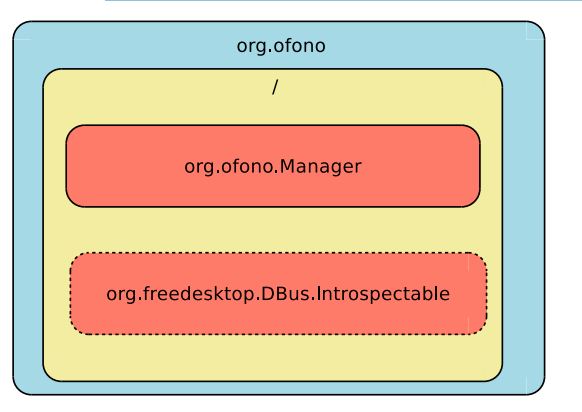

- Can be compared to a “namespace”
- Has a unique name using dots (ie org.ofono.Manager)
- Contains members: properties, methods and signals
 
  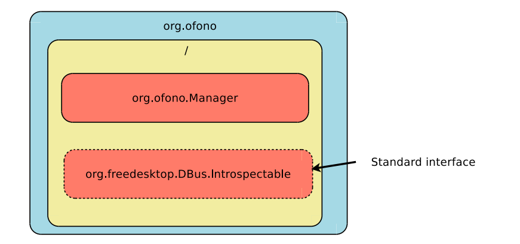
- Interfaces expose properties, methods and signals
- D-Bus defines a few standard interfaces
- They all belong to the namespace “org.freedesktop.DBus” :

    - org.freedesktop.DBus.Introspectable : Provides an introspection mechanism.
Exposes information about the object (interfaces, methods and signals it implements)
    
   - org.freedesktop.DBus.Peer : Provides methods to know if a connection is alive
(ping)
   - org.freedesktop.DBus.Properties : Provides methods and signals to handle
properties
   - org.freedesktop.DBus.ObjectManager : Provides an helpful API to handle
sub-tree objects
   
## Interfaces expose properties, methods and signals Properties

### Properties
- Directly accessible fields
- Can be read / written
- Can be of different types defined by the D-Bus specification :
    - basic types: bytes, boolean, integer, double, ...
    - string-like types : string, object path (must be valid) and signature
    - container-types: structure, array, variant (complex types) and dictionnary entry
(hash)
- Very convenient standard interface : org.freedesktop.DBus.Properties

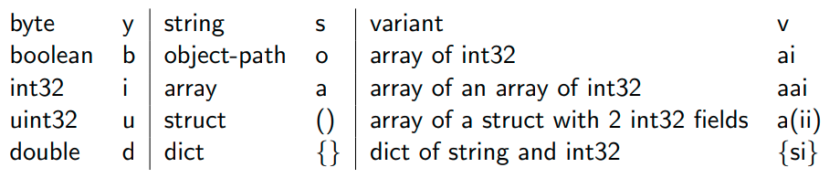

- Types are represented by characters

### Methods
- allow remote procedure calls from one process to another
- Can be passed one or several parameters
- Can return values/objects
- Look like any method you could know from other languages
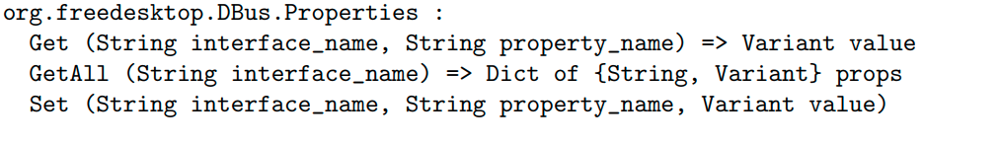

### Signals


- Messages / notifications
- Unidirectionnal
- Sent to every clients that are listening to it
- Can contain parameters
- A client will subscribe to signals to get notifications

### Policy

- Adds a security mechanism
- Represented by XML files
- Handled by each dbus-daemon (under /etc/dbus-1/session.d and
/etc/dbus-1/system.d)
- Allows the administrator to control which user can talk to which interface, which
user can send message to which interface, and so on
- If you are not able to talk with a D-Bus service or get an
org.freedesktop.DBus.Error.AccessDenied error, check this file!
- org.freedesktop.PolicyKit1 has been created to handle all security accesses

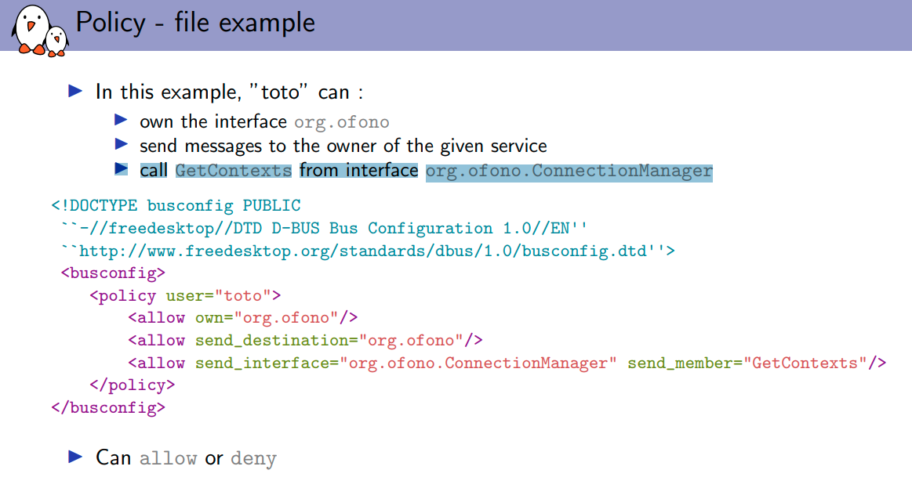


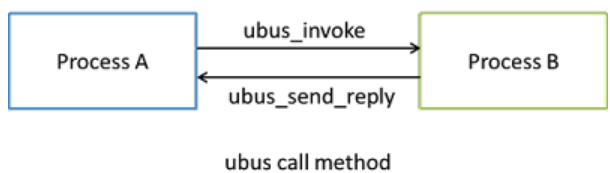
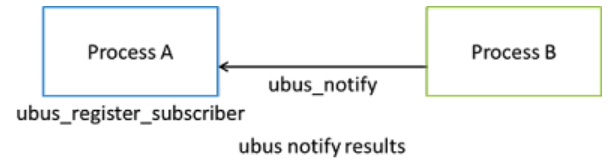


# DBUS-Debugger 
# d-feet

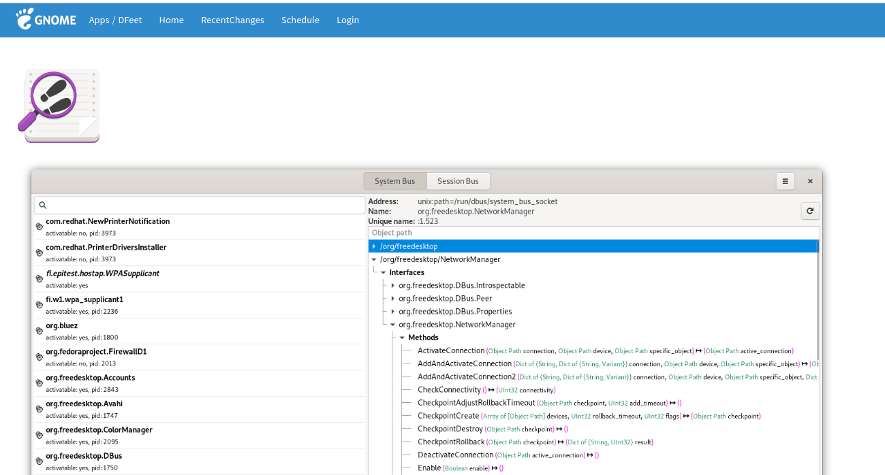

## Features
1. View names on any bus
2. View exported objects, interfaces, methods and signals
3. View the full command line of services on the bus
4. Execute methods with parameters on the bus and see their return values
5. Show values of properties

https://dbus.freedesktop.org/doc/api/html/group__DBusErrors.html#ga8937f0b7cdf8554fa6305158ce453fbe


http://www.matthew.ath.cx/articles/dbus


```
sudo apt-get update
sudo apt-get install d-feet
d-feet
```


## D-Feet elenments 

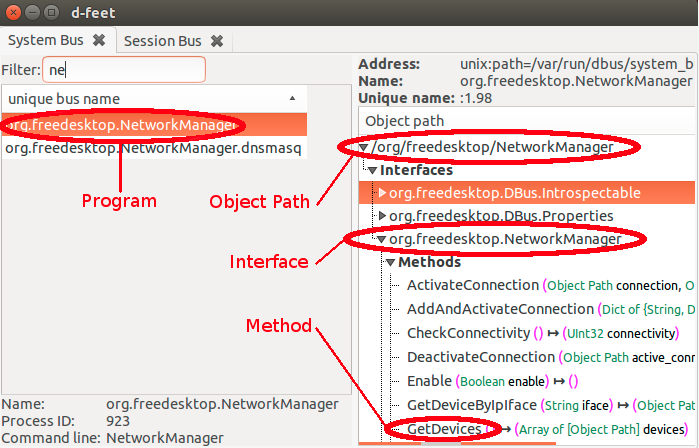


```
D-Feet - install from Ubuntu Software
busctl - e.g. busctl --user tree INTERFACE_NAME
dbus-monitor - execute from CLI
```